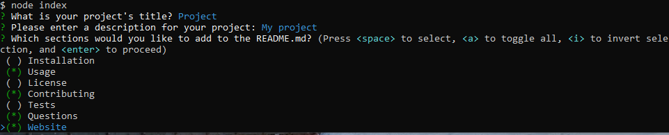

# README Generator

## Description
A node.js application that allows you to generate a README.md by answering prompts in the terminal. The app formats the entire README for you.

## Installation
Clone the GitHub repository here https://github.com/Chance-Crawford/README-Generator

Cd to project root, type command npm init.

type node index.js to run app from project's root.

## Video Demonstration
https://www.youtube.com/watch?v=7Rhzc-kDUaI
